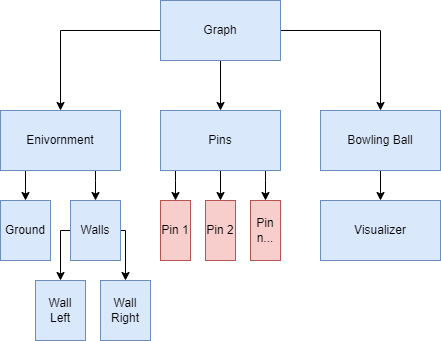

## Format

  - Title: 3DBowling
  - Author: Fischer Dennis
  - Year and season (Summer, Winter): Sommersemester 2022
  - Curriculum and semester: MIB7
  - Course this development was created in: PRIMA
  - Docent: Prof. Jirka Dell'Oro-Friedl
  * Link to the finished and executable application on Github-Pages: https://dykunxv.github.io/PRIMA/3DBowling/
  * Link to the source code: https://github.com/DykunXV/PRIMA/tree/main/3DBowling
  * Link to the design document: https://github.com/DykunXV/PRIMA/blob/main/3DBowling/Design/3DBowling%20Design%20Document.pdf
  * Description for users on how to interact: Bevor der Ball geworfen werden kann muss die Kraft und der Winkel bestimmt werden. Das Spiel schwankt hier, nacheinander, zwischen verschiedenen Werten und der Spieler muss, durch drücken der Leertaste, beim gewünschten Wert anhalten. Sobald dies getan ist, kann der Ball mit dem "R"-Taste geworfen werden. Ganz zu Anfang, bevor Kraft und Winkel bestimmt sind, ist es ebenfalls möglich, mit der "A"-Taste und der "D"-Taste, die horizontale Position des Balls zu verändern.
  * Description on how to install, if applicable (additional services, database etc.): Trifft nicht zu.
  * A copy of the catalogue of criteria above, the right column replaced with very brief explanations and descriptions of the fullfullments of these criteria: Siehe folgende Tabelle.

## Checklist for the final assignment

© Prof. Dipl.-Ing. Jirka R. Dell'Oro-Friedl, HFU
| Nr | Criterion | Explanation |
|---:|---------------------|---------------------------------------------------------------------------------------------------------------------|
| 1 | Units and Positions | Mit dem Hintergrund, dass der größte Teil der Positionierung, im Code, bei den Pins stattfindet, ist dort auch der Nullpunkt. Die Bowling Kugel selber ist 1 x 1 x 1 groß und die Pins sind 0.6 x 2 x 0.6 |
| 2 | Hierarchy |    Die Hierarchy ist in drei Hauptpunkte unterteilt. Umgebung, Pins und die Bowling Kugel. In der Umgebung lässt sich alles finden, was eben statisch ist und nur als Deko dient. In den Pins sind alle Pins, als einzelne Node, vom Code angelegt. In der Bowling Kugel, ist die Bowling Kugel selber und dieser ist ein Visualizer unterteilt, der dem Spieler beim Werfen helfen soll. |
| 3 | Editor | Da ich letztendlich immer mit den selben Objekten arbeite und keine neuen Objekte ins Spiel generiert werden, wäre theoretisch alles mit dem Editor machbar. Ich habe jedoch die Bowling Pins als Code angelegt. Der Hintergedanke ist, dass das Umstellen der Kegel für spezielle Spielmodi so einfacher ist. |
| 4 | Scriptcomponents | Der Lichtquelle wurde eine Scriptkomponente hinzugefügt, damit diese den Ball verfolgt. Theoretisch hätte man das auch direkt in der Main.ts machen können, aber die Scriptkomponente hält den Code schön ordentlich. |
| 5 | Extend | Die Pins sind von der Node Klasse erweitert. Es wäre im meinem Kontext sinnvoll für extra Spielmodi, bei dem die Pins verschiedene Eigenschaften besitzen. |
| 6 | Sound | Es gibt verschiedene Sounds. Diese werden beispielweise abgespielt, wenn der Bowlingball geworfen wird, oder mit den Pins kollidiert. |
| 7 | VUI | Dem Spieler ist ein Interface gegeben, das ihm beim Werfen der Bowling Kugel helfen soll. Dort wird angezeigt wie hart die Kugel geworfen wird und in welchem Winkel. Zudem wird die Score dort auch angezeigt. |
| 8 | Event-System | Neben den Keyboard Events, gibt es noch Collision Events, die genutzt werden. Beispielweise dann, wenn die Kugel mit den Pins kollidiert. |
| 9 | External Data | Die Score wird, bei Start, aus der beigelegten config.json gezogen. Für die Score habe ich mich entschieden, weil das etwas wäre, das der Spieler speichern möchte und beim erneuten Starten des Spiels nicht verlieren will. |
| A | Light | Da beim Bowling Licht normalerweise keine große Rolle spielt, habe ich, zur Demonstration, eine Lichtquelle hinzugefügt, die die Position des Balls verfolgt. |
| B | Physics | Das ganze Spiel basiert auf Phyiscs. Die Umgebung, die Pins und die Bowling Kugel. |
| C | Net | Nicht implementiert. |
| D | State Machines | Nicht implementiert. |
| E | Animation | Die Animations sind alle in FudgeCore und beruhen größtenteils auf Physik. Andere Animationen, die vorhanden sind, sind der Visualizer, der größer und kleiner wird, beim Vorbereiten des Werfen. Ebenso ändert der Visualizer seine Farbe, je nachdem wie lange er gerade ist. Zudem rotiert der Visualizer noch um die Kugel, damit der Spieler weiß, in welchem Winkel er die Kugel wirft. |
